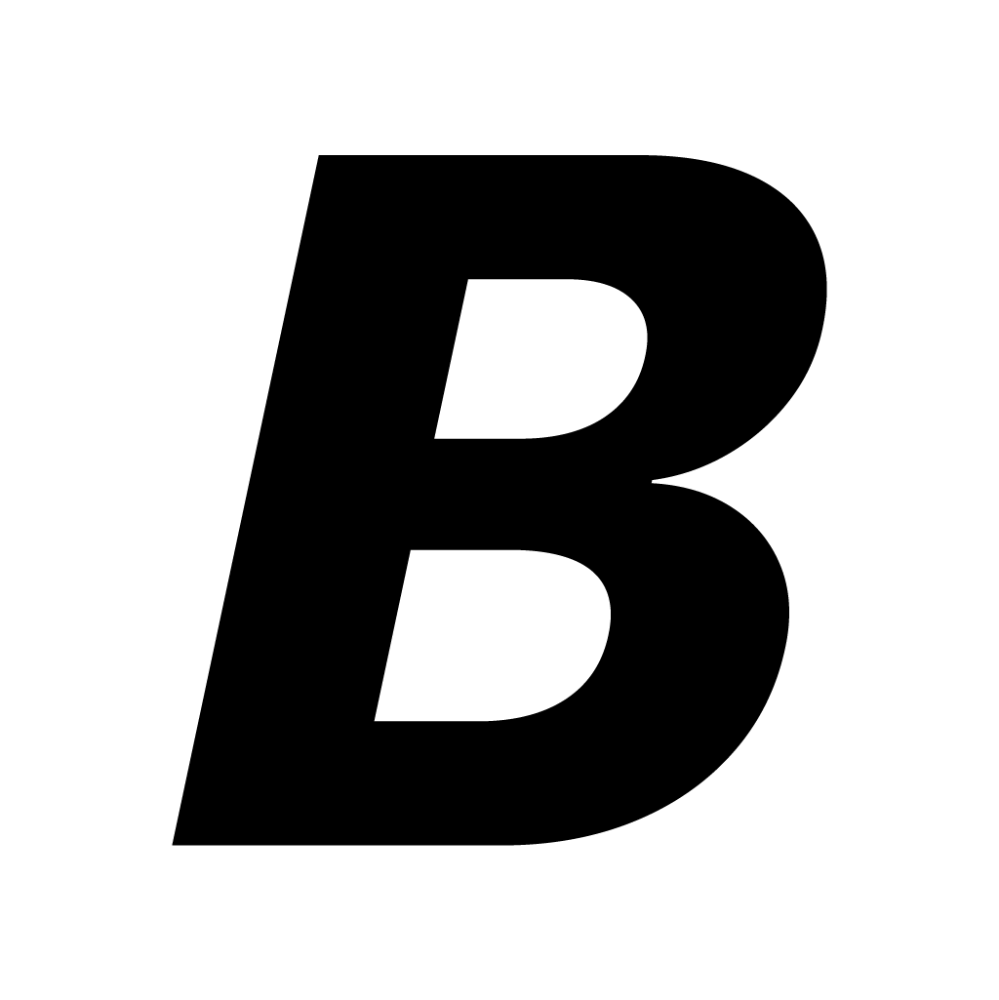

<div align="center">
  
  <h1>Badges</h1>
  <p><strong>File-type badges for your file manager.</strong> Small icons on file
  previews so you can tell a <code>.psd</code> from an <code>.ai</code> from a
  <code>.blend</code> at a glance — without opening anything.</p>
</div>

---

Badges overlays a little type-badge on files in your OS file browser. It's the
designer/producer utility the built-in generic icons never gave you: see project
files by kind, right in the window you're already looking at.

- **Free** and open source (MIT). Donate if it saves you time.
- One badge per file, drawn by the OS file browser (never replaces the real preview).
- Add your own formats and badges (no app update needed).

## Platforms

| Platform | Mechanism | Status |
|----------|-----------|--------|
| **macOS** | FinderSync extension | ✅ Working — [`platforms/macos`](platforms/macos) |
| **Windows** | Explorer icon overlay handler | 🔜 Planned — [`platforms/windows`](platforms/windows) |
| **Linux** | Nautilus / Dolphin extensions | 🔜 Planned — [`platforms/linux`](platforms/linux) |

Each platform is a native shell integration (they can't share UI code), but they all
read **one portable ruleset** so behaviour and artwork stay in sync.

## Repo layout

```
platforms/
  macos/     SwiftUI menu-bar app + FinderSync extension  (built)
  windows/   design brief for the Explorer overlay handler
  linux/     design brief for the file-manager extensions
shared/
  rules.default.json        the default ruleset (the original 6 badges)
  schema/rules.schema.json  portable ruleset schema every platform reads
  badges/                   1024px badge master art (psd, ai, pdf, svg, mp4, blend)
PLAN.md      roadmap / source of truth for scope + phases
```

## Try it (macOS)

> **Heads up:** there's **no one-click download yet.** Until the app is notarized
> with an Apple *Developer ID*, a prebuilt binary won't launch on someone else's Mac
> (Gatekeeper blocks it, and a dev-signed build only runs on the developer's own
> machines). So for now Badges is **build-from-source** — a bit technical, but if
> you're comfortable in the terminal it's ~2 minutes. A signed `.dmg` is coming.

You need macOS 14.6+ and **full Xcode** installed (not just Command Line Tools).

```sh
# 1. tools
brew install xcodegen
xcode-select --install                      # if you don't have Xcode CLTs

# 2. get the code
git clone https://github.com/winstt/badges.git
cd badges/platforms/macos

# 3. build
xcodegen generate
xcodebuild -project Badges.xcodeproj -scheme Badges -configuration Release build

# 4. install into /Applications (FinderSync only loads from there)
APP=$(xcodebuild -project Badges.xcodeproj -scheme Badges -configuration Release \
        -showBuildSettings | awk -F' = ' \
        '/ TARGET_BUILD_DIR /{d=$2} / FULL_PRODUCT_NAME /{n=$2} END{print d"/"n}')
cp -R "$APP" /Applications/Badges.app
open /Applications/Badges.app
```

Then enable the extension in **System Settings → General → Login Items & Extensions
→ Finder**, and look for the **B** in your menu bar. Badges show on matching files
in Finder. (Using Adobe Creative Cloud? Its Finder extension can hog the badge slot —
disable *Core Sync* under the same Extensions pane if badges don't appear.)

Build details, dev loop, and gotchas: [`platforms/macos/README.md`](platforms/macos/README.md).

## Status

macOS is working and in active development. Next milestone: **Developer ID signing →
notarized `.dmg` → landing page** so anyone can install it with a double-click (see
[PLAN.md](PLAN.md)). Windows and Linux are scoped but not started.
