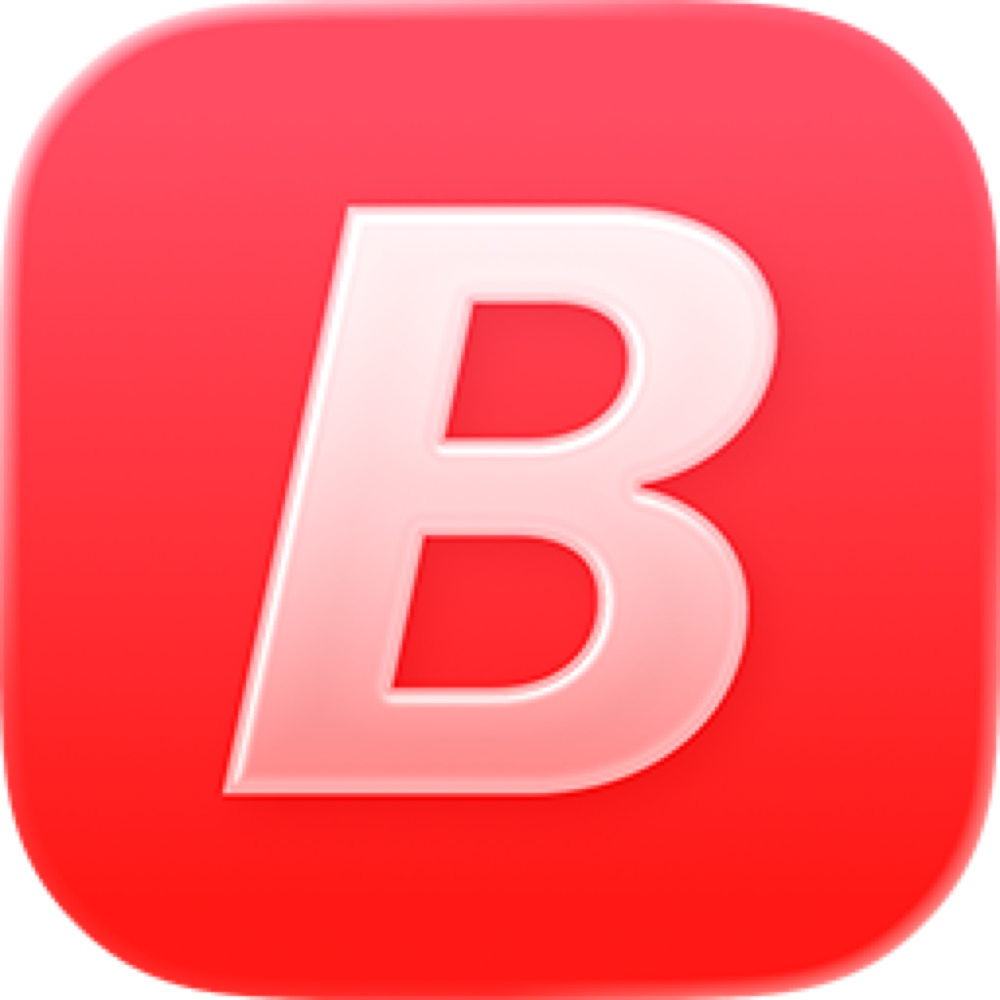
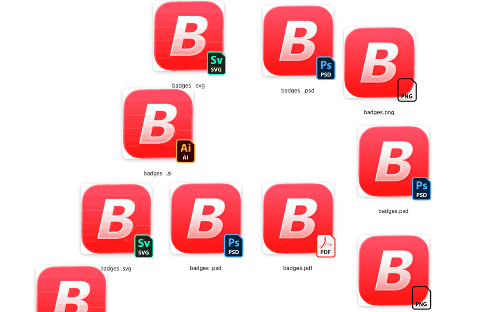
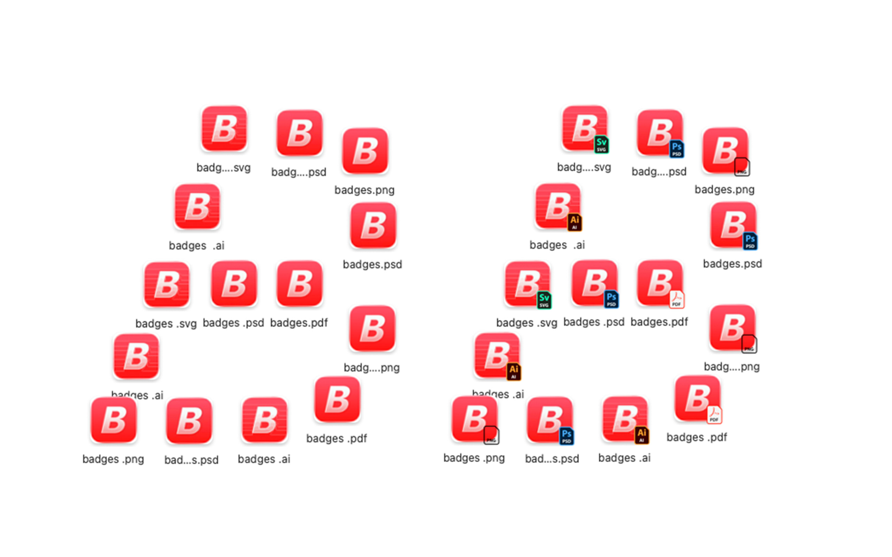
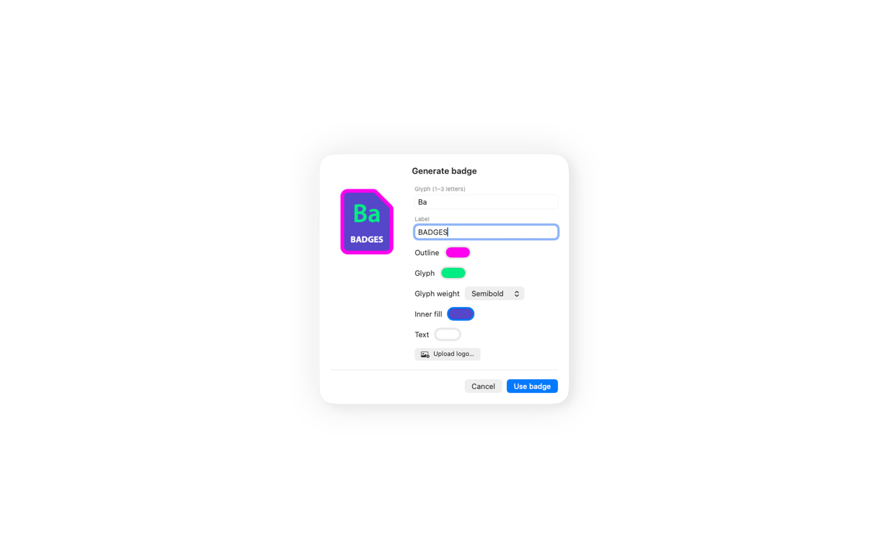

  
  <h1>Badges</h1>
  
<strong>A Finder extension that adds a badge system to your file formats.</strong> 
  Small type-badges on file previews, so you can tell a <code>.psd</code> from a
  <code>.png</code> at a glance — without opening anything.

---

Badges started as a way to visually tell apart lookalike files — a `.psd` from a `.png`,from their preview — right in the Finder window you're already looking at. It
grew into a small system for **assigning icons to the formats you work with**.

- **Flexibility** — badge any format you like, not a fixed list.
- **Organization** — see project files by kind at a glance, no opening required.
- **Customization** — use the built-in badges, generate your own on-brand ones, or
  upload your own art.

It's a native **FinderSync** extension (one badge per file, drawn by Finder — it never
replaces the real preview) with a menu-bar app to manage everything. **Free** and open
source (MIT).

## Supported formats

| Category | Formats |
|----------|---------|
| **Graphics** | Photoshop (`.psd` `.psb`), Illustrator (`.ai`), After Effects (`.aep`), Premiere (`.prproj`), PDF (`.pdf`), SVG (`.svg`) |
| **Music** | MP3 (`.mp3`), WAV (`.wav`), FL Studio (`.flp`) |
| **Video** | MP4 (`.mp4`), MKV (`.mkv`), MOV (`.mov`) |
| **Images** | PNG (`.png`), HEIC (`.heic`) |
| **3D** | Blender (`.blend`) |

**➕ Add more, anytime.** Any extension you want, with a badge you **generate in-app**
(house-style card + your colours + label) or **upload** yourself — no app update needed.

## Try it (macOS)

**Badges 1.0 is out** — a signed, Apple-notarized build you can install with a
double-click. Requires **macOS 14.6 or later** (works on Sonoma, Sequoia and Tahoe).

- ⬇️ **[Download the latest release](https://github.com/winstt/badges/releases/latest)** (`.dmg`, free)
- 🛒 **[Get it on Gumroad](https://6478320158004.gumroad.com/l/badges)** — pay what you want

Open the `.dmg`, drag **Badges** into **Applications**, launch it, then enable the
extension in **System Settings → General → Login Items & Extensions → Finder**. Look
for the **B** in your menu bar — badges appear on matching files in Finder.

> Using Adobe Creative Cloud? Its Finder extension can hog the badge slot — turn off
> *Core Sync* under the same Extensions pane if badges don't appear. (Badges detects
> this and links you straight there.)

## Screenshots

    
    
  

## Support

Badges is free and open source. If it saves you time, you can
**[buy me a coffee](https://ko-fi.com/matyasnow)** ☕ — thank you!
